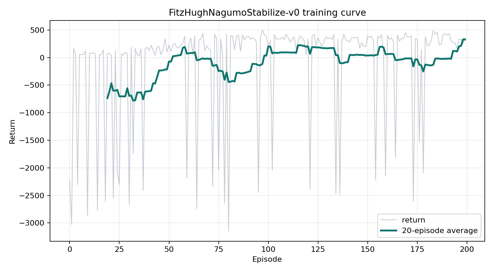
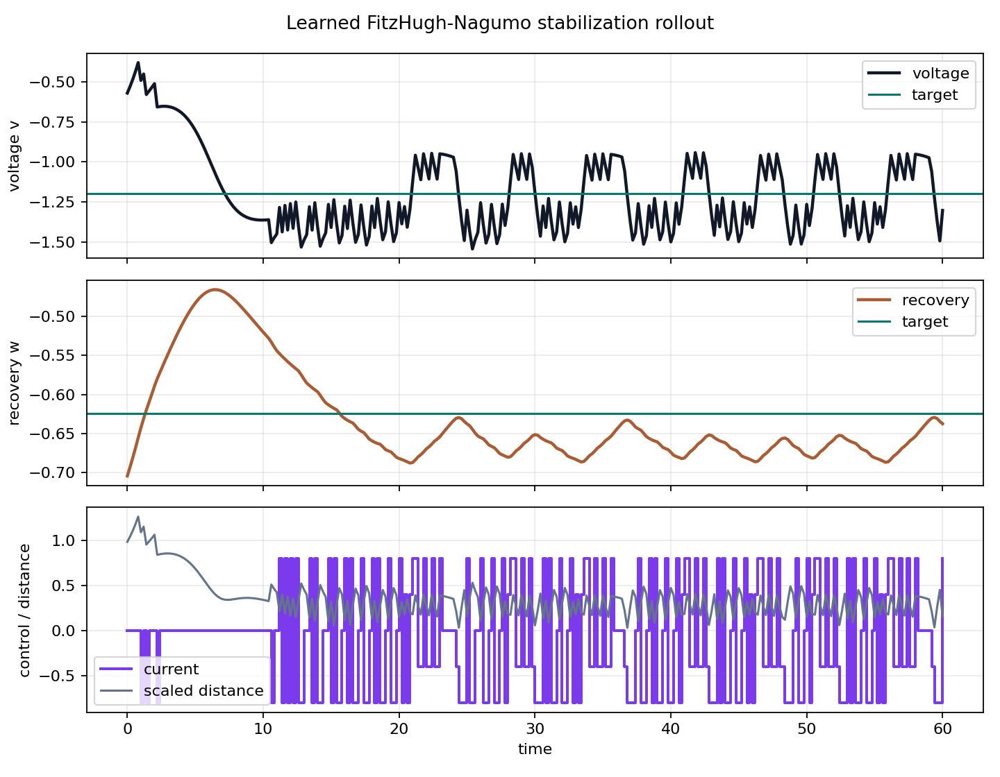

# FitzHugh-Nagumo Stabilization with Sarsa(λ)

## Abstract

This project studies reinforcement-learning control of a simplified excitable
heart-cell model. A tile-coded True Online Sarsa(λ) agent learns to apply
bounded stimulation currents to the FitzHugh-Nagumo system, with the objective
of stabilizing the voltage and recovery variables near the model's quiescent
equilibrium while avoiding excessive control effort.

In a representative 200-episode run, the controller improved from an average
return of `-735.6` over the first 20 episodes to `328.0` over the final 20
episodes. The final episode achieved a return of `359.4`, and the best episode
achieved `492.4`. A greedy rollout from the learned policy produced a
301 frame animation showing the controlled trajectory in phase space and in
time-series form.

## 1. Problem Statement

The FitzHugh-Nagumo model is a reduced description of excitable-cell dynamics.
It keeps only two state variables:

- `v`: a fast variable (membrane-voltage)
- `w`: a slow variable (recovery)

The control task is to choose a discrete stimulation current,
`I_control`, that drives `(v, w)` toward a stable quiescent target and keeps the
system close to that target. This creates a small but meaningful nonlinear
control problem: weak stimulation may not correct excursions, while excessive
stimulation can drive the state away from equilibrium or waste effort.

## 2. Model

The environment integrates the FitzHugh-Nagumo equations:

```text
dv/dt = v - v^3 / 3 - w + I_background + I_control
dw/dt = (v + a - b w) / tau
```

The local environment is named `FitzHughNagumoStabilize-v0`. Each episode begins
from a random perturbation around the equilibrium. At each control step, the
agent selects one bounded current from a discrete action set. The reward
penalizes scaled voltage error, scaled recovery error, and current magnitude,
with a bonus for entering a small target region around the equilibrium.

## 3. Method

The controller uses a linear action-value function with tile-coded state-action
features. For each action, the feature encoder activates one tile in each
offset tiling. This produces a sparse binary representation that lets a linear
model generalize across nearby `(v, w)` states while retaining local resolution.

Training uses True Online Sarsa(λ):

1. select an action with an epsilon-greedy policy,
2. observe the next state and reward,
3. compute the TD error,
4. update the Dutch eligibility trace,
5. apply the True Online Sarsa(λ) weight update.

Important hyperparameters:

- `lambda`: eligibility-trace decay. Higher values assign credit farther back
  through the episode.
- `alpha`: step size. Useful values depend on `num_tilings` because several
  binary features are active at once.
- `num_tilings`: number of offset tilings. More tilings increase resolution and
  feature-vector size.
- `tile_width`: tile size for `(v, w)`. Smaller widths give finer resolution;
  larger widths generalize more broadly.

## 4. Experimental Setup

The representative result in this repository is saved at:

```text
results/20260429-141813_FitzHughNagumoStabilize-v0_seed42
```

Configuration:

| Parameter | Value |
| --- | ---: |
| Episodes | `200` |
| Seed | `42` |
| Discount `gamma` | `0.99` |
| Trace decay `lambda` | `0.9` |
| Step size `alpha` | `0.01` |
| Exploration `epsilon` | `0.08` |
| Tilings | `8` |
| Tile width | `(0.25, 0.15)` |
| Environment horizon | `300` control steps |

Saved artifacts from the run:

- `config.json`: environment, algorithm, hyperparameters, and seed.
- `returns.csv`: per-episode return and episode length.
- `returns.npz`: NumPy arrays for later analysis.
- `weights.npz`: learned weights and tile-coder metadata.
- `training_curve.png`: return curve over episodes.
- `policy_12s.gif`: learned greedy-policy animation.
- `stabilization_rollout.csv`: greedy rollout values for voltage, recovery,
  current, reward, and target distance.
- `stabilization_rollout.png`: static rollout visualization.

## 5. Results

### 5.1 Training Curve



The learning curve shows large negative returns early in training, followed by
a shift toward consistently positive returns. The first 20 episodes averaged
`-735.6`, while the final 20 averaged `328.0`. Out of 200 episodes, 171 had
positive returns. The late-training behavior is still variable, but the sign
and magnitude of the returns indicate that the agent learned a useful
stabilizing policy rather than merely avoiding catastrophic trajectories.

### 5.2 Learned Stabilization Rollout



In the greedy rollout, the controller keeps the state near the target region
for the full 300-step horizon. The final state was:

| Quantity | Final | Target |
| --- | ---: | ---: |
| Voltage `v` | `-1.3036` | `-1.1997` |
| Recovery `w` | `-0.6374` | `-0.6247` |

The final scaled distance to the target was `0.1623`, and the mean scaled
distance over the final 50 rollout steps was `0.2789`. The policy does not
collapse exactly onto the fixed point, but it remains close enough to show
effective stabilization under the reward design used here. The final-50-step
mean absolute control current was `0.5680`, suggesting that the learned policy
still uses substantial active stimulation to maintain regulation.

### 5.3 Learned Policy Animation


The animation has `301` frames at `24 fps`, for a verified playback duration of
approximately `12.04` seconds. The left panel shows the phase-plane trajectory
relative to the FitzHugh-Nagumo nullclines and target point. The right panels
show voltage over time and the applied stimulation current. Qualitatively, the
policy makes corrective current choices that keep the trajectory bounded near
the stable region rather than allowing large excursions through the phase
plane.

## 6. Interpretation

The learned controller demonstrates that tile-coded Sarsa(λ) can discover
a useful feedback policy for this simplified nonlinear excitable-cell system.
The most important evidence is the improvement in return across training and
the greedy rollout's ability to stay near the quiescent target for the full
horizon.

The results also show the limits of this initial setup. The residual target
distance and nontrivial average control current imply that the policy is more
of a stabilizing regulator than an optimal low-energy controller. Increasing
training length, tuning the effort penalty, adding more tilings, or performing
the included hyperparameter sweep may reduce the residual oscillation and
control usage.

Because this is a single-seed representative run, the reported numbers should
be treated as a demonstration rather than a statistically complete evaluation.
A stronger study would report means and confidence intervals across many seeds
and compare against classical baselines such as proportional feedback, LQR on a
linearized model, or model-predictive control.

## 7. Reproduction

Create an environment and install dependencies:

```powershell
python -m venv .venv
.\.venv\Scripts\Activate.ps1
python -m pip install --upgrade pip
python -m pip install -e .
```

If editable install is not needed:

```powershell
python -m pip install -r requirements.txt
```

Run training:

```powershell
python scripts/train.py --episodes 300 --seed 7
```

Skip GIF rendering during a long batch run:

```powershell
python scripts/train.py --episodes 500 --seed 3 --no-render-gif
```

Render a saved policy:

```powershell
python scripts/render_policy.py --weights results\RUN_DIR\weights.npz --output results\RUN_DIR\policy_12s.gif --fps 24
```

Run a hyperparameter sweep:

```powershell
python scripts/compare_hyperparams.py --episodes 120 --seeds 0 1 2
```

Example custom sweep:

```powershell
python scripts/compare_hyperparams.py `
  --episodes 200 `
  --lambdas 0.0 0.5 0.9 `
  --alphas 0.005 0.01 0.02 `
  --tilings 4 8 12 `
  --tile-widths 0.20,0.10 0.25,0.15 0.35,0.20
```

## 8. Reproducibility Notes

Every script accepts `--seed`. Training uses `numpy.random.Generator`, seeds
spaces where supported, and resets each episode with `seed + episode_index`.
Saved `config.json`, `returns.npz`, `weights.npz`, and rollout CSV files make
each experiment inspectable after training.

The local compatibility helpers normalize Gymnasium/Gym-style `reset`, `step`,
seeding, and RGB rendering conventions for the FHN environment.

## 9. Limitations and Next Steps

- Evaluate across many random seeds and report aggregate confidence intervals.
- Compare Sarsa(λ) against classical feedback controllers and modern RL
  baselines.
- Sweep the reward's control-effort penalty to study the regulation-energy
  tradeoff.
- Add stochastic perturbations or time-varying background current to test
  robustness.
- Extend the model toward richer cardiac-cell dynamics only after the simplified
  benchmark is well characterized.
